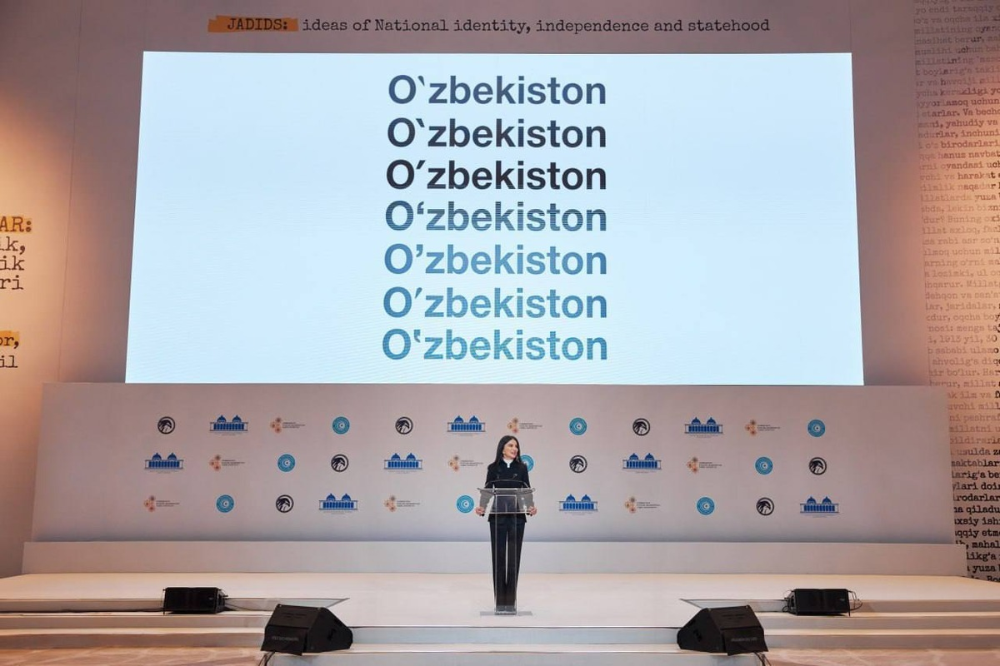

# Oʻzbek lotin alifbosi zamonaviy qurilmalarda

## Tutuq belgisi, oʻ va gʻ harflari

Oʻzbek lotin alifbosi 1995-yildagi islohotlardan soʻng, oʻ va gʻ harflaridagi teskari vergul hamda tutuq belgisi uchun kompyuter tizimlarida qanday belgi ishlatilishi aniq belgilanmagan. Bu holat raqamli tizimlarda, xususan, veb-saytlar va ijtimoiy tarmoqlarda katta chalkashliklarga sabab boʻlmoqda. Hozirda bir nechta belgilar aralash holda qoʻllanilmoqda, masalan:

| Belgi | Unicode | Misol |
| --- | --- | --- |
| ' | U+0027 | O'zbekiston , fe'l |
| \` | U+0060 | O\`zbek tili, fe\`l |
| ‘ | U+2018 | O‘zbekiston |
| ’ | U+2019 | fe’l |
| ʻ | U+02BB | Oʻzbekiston |
| ʼ | U+02BC | Feʼl |

Bu standartning yoʻqligi bir qancha jiddiy muammolarni keltirib chiqaradi:

1. **Matn qidirish qiyinlashadi.** Qidiruv tizimlari va dasturlar soʻzlardagi turli apostrof belgilarini farqli belgilar deb hisoblaydi. Natijada, bir xil soʻz uchun har xil yozuvlar mavjud boʻlib, qidiruv natijalari toʻliq chiqmasligi mumkin. Masalan, "O'zbekiston" deb qidirgan foydalanuvchi "Oʻzbekiston" soʻzi bor maʼlumotni topa olmasligi mumkin.

2. **Apostrof soʻzni ikkiga boʻladi.** Baʼzi dasturlar U+0027 apostrofini (standart klaviaturadagi  \' belgisi) harf sifatida emas, balki soʻzlar orasidagi ajratuvchi belgi deb hisoblaydi. Bu matnni qayta ishlashda, masalan, soʻzlarni sanashda yoki tarjima qilishda muammolarni keltirib chiqaradi.

3. **Dasturchilar uchun ortiqcha ish.** Dasturchilar matnni qayta ishlashda va uni toʻgʻri koʻrsatishda barcha variantlarni hisobga olishlari kerak boʻladi. Bu esa dasturlash jarayonini murakkablashtiradi va kodni koʻpaytiradi.

## Yechim: Standartlashtirilgan Belgilarni Tanlash

Bu muammolarni bartaraf etish uchun, oʻzbek tili raqamli muhitini mahalliylashtirish hamjamiyati, standartlashtirish boʻyicha bir qator takliflarni ishlab chiqdi. Bu takliflarga koʻra, rasmiy va texnik jihatdan eng toʻgʻri hisoblangan belgilar qabul qilindi. Bu belgilar:

- ʻ (U+02BB) — oʻ va gʻ harflaridagi teskari vergul uchun.

- ʼ (U+02BC) — tutuq belgisi uchun.

### Kiritish usullari

Afsuski, hozirda oʻzbek lotin alifbosi uchun standart klaviatura tuzilmasi mavjud emas. Shunga qaramay, yuqorida keltirilgan standart belgilarni bir qancha usullar orqali kiritish mumkin.

#### Mobil qurilmalar (Android)

**GBoard klaviaturasi** ushbu muammoni eng oson hal qiluvchi yechimlardan biridir. GBoard ichida oʻzbek lotin klaviaturasi oʻrnatilgan boʻlib, unda oʻ va gʻ harflari toʻgʻri belgilangan.

- GBoard klaviaturasini oʻrnating.

- Til sozlamalari orqali "Oʻzbekcha (Lotin)" klaviaturasini faollashtiring.

<!-- TODO: Include screenshots of GBoard -->

#### Kompyuter (Linux)

Linux operatsion tizimlarida oʻzbek lotin klaviaturasi standart oʻrnatilmagan boʻlishi mumkin. Vaqtinchalik yechim sifatida mavjud klaviatura tuzilmasini moslashtirish mumkin. Masalan, oddiy US QWERTY klaviaturasini oʻzgartirish orqali ʻ va ʼ belgilarini kiritish imkoniyati yaratiladi. Bu usul texnik bilimni talab etadi, lekin tizimga toʻliq integratsiya boʻlgan yechim hisoblanadi.

<!-- TODO: Include screenshot of modified keyboard layout on Linux -->
<!-- TODO: Include skript for uzbek keyboard layout on Linux -->

<!-- TODO: Explore other popular options: Samsung keyboard, SwiftKey, etc. -->

<!-- TODO: Input options for iOS, MacOS, Windows -->

### Havolalar

- [https://lex.uz/docs/-112286](https://lex.uz/docs/-112286)
- [https://uz.wikipedia.org/wiki/%CA%BB_(belgi)](https://uz.wikipedia.org/wiki/%CA%BB_(belgi))
- [https://uz.wikipedia.org/wiki/%CA%BB_(belgi)](https://uz.wikipedia.org/wiki/%CA%BC_(belgi))
