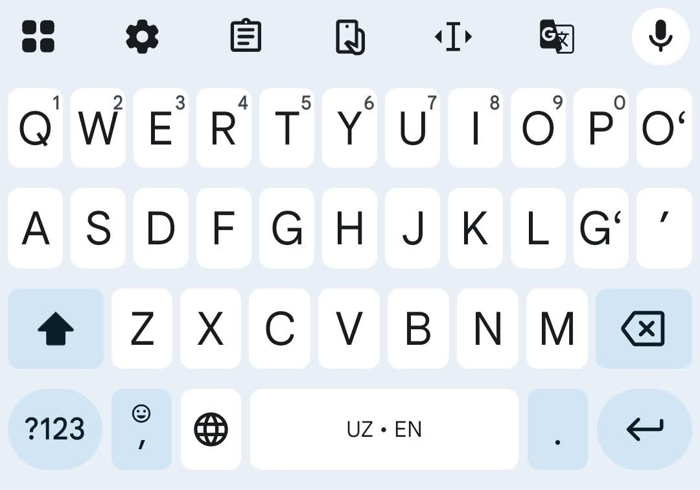

# Oʻzbek lotin alifbosi zamonaviy qurilmalarda

## Tutuq belgisi, oʻ va gʻ harflari


Oʻzbek lotin alifbosi 1995-yildagi islohotlardan soʻng, oʻ va gʻ
harflaridagi teskari vergul hamda tutuq belgisi uchun kompyuter tizimlarida
qanday belgi ishlatilishi aniq belgilanmagan. Bu holat raqamli tizimlarda,
xususan, veb-saytlar va ijtimoiy tarmoqlarda katta chalkashliklarga sabab
boʻlmoqda. Hozirda bir nechta belgilar aralash holda qoʻllanilmoqda, masalan:

| Belgi | Unicode | Misol |
| --- | --- | --- |
| ' | U+0027 | O'zbekiston , fe'l |
| \` | U+0060 | O\`zbek tili, fe\`l |
| ‘ | U+2018 | O‘zbekiston |
| ’ | U+2019 | fe’l |
| ʻ | U+02BB | Oʻzbekiston |
| ʼ | U+02BC | Feʼl |

Bu standartning yoʻqligi bir qancha jiddiy muammolarni keltirib chiqaradi:

1. **Matn qidirish qiyinlashadi.** Qidiruv tizimlari va dasturlar soʻzlardagi
turli apostrof belgilarini farqli belgilar deb hisoblaydi. Natijada, bir
xil soʻz uchun har xil yozuvlar mavjud boʻlib, qidiruv natijalari toʻliq
chiqmasligi mumkin. Masalan, "O'zbekiston" deb qidirgan foydalanuvchi
"Oʻzbekiston" soʻzi bor maʼlumotni topa olmasligi mumkin.

1. **Apostrof soʻzni ikkiga boʻladi.** Baʼzi dasturlar U+0027 apostrofini
(standart klaviaturadagi  \' belgisi) harf sifatida emas, balki soʻzlar
orasidagi ajratuvchi belgi deb hisoblaydi.  Bu matnni qayta ishlashda, masalan,
soʻzlarni sanashda yoki tarjima qilishda muammolarni keltirib chiqaradi.

2. **Dasturchilar uchun ortiqcha ish.** Dasturchilar matnni qayta ishlashda
va uni toʻgʻri koʻrsatishda barcha variantlarni hisobga olishlari
kerak boʻladi. Bu esa dasturlash jarayonini murakkablashtiradi va kodni
koʻpaytiradi.

## Yechim: Standartlashtirilgan Belgilarni Tanlash

Bu muammolarni bartaraf etish uchun, oʻzbek tili raqamli muhitini
mahalliylashtirish hamjamiyati, standartlashtirish boʻyicha bir qator
takliflarni ishlab chiqdi. Bu takliflarga koʻra, rasmiy va texnik jihatdan
eng toʻgʻri hisoblangan belgilar qabul qilindi.  Bu belgilar:

- ʻ (U+02BB) — oʻ va gʻ harflaridagi teskari vergul uchun.

- ʼ (U+02BC) — tutuq belgisi uchun.

## Kiritish usullari

Afsuski, hozirda oʻzbek lotin alifbosi uchun standart klaviatura tuzilmasi
mavjud emas. Shunga qaramay, yuqorida keltirilgan standart belgilarni bir
qancha usullar orqali kiritish mumkin.

### Mobil qurilmalar (Android)

**GBoard klaviaturasi** ushbu muammoni eng oson hal qiluvchi yechimlardan
biridir. GBoard ichida oʻzbek lotin klaviaturasi oʻrnatilgan boʻlib,
unda oʻ va gʻ harflari toʻgʻri belgilangan.

- GBoard klaviaturasini oʻrnating.

- Til sozlamalari orqali "Oʻzbekcha (Lotin)" klaviaturasini faollashtiring.



### Windows va macOS

Windows va macOS operatsion tizimlarida oʻzbek tili uchun standart
klaviatura mavjud emas. Shu sababli, bu muammoni hal qilish uchun
[Farhodjon Chinberdiev](https://github.com/far5n10v) tomonidan maxsus
[dasturiy taʼminot](https://github.com/far5n10v/uzbek-typography-layouts)
yaratdi. Ushbu dasturni oʻrnatish orqali siz oʻzbek harflari (oʻ, gʻ),
shuningdek, turk harflarini (Ö, Ğ, Ş, Ç, İ) terish imkoniyatiga ega
boʻlasiz.


- **Tutuq belgisi:** ` (gravis) tugmasini bosing.

- **Oʻ va Gʻ harflari:** `'` (apostrof) tugmasini bosing.

- **Turk harflari (Ö, Ğ, Ş, Ç, İ):** `Alt` (Windows) yoki `Option`
(macOS) tugmasini bosib turgan holda tegishli harflarni (`o`, `g`, `s`, `c`,
`i`) bosing.

- **Em dash (—):** `Alt + -` (Windows) yoki `Option + -` (macOS) tugmalarini
bosing.

- **En dash (–):** `Alt + Shift + -` (Windows) yoki `Option + Shift + -`
(macOS) tugmalarini bosing.

- **Uzilmas boʻshliq (non-breaking space):** `Alt + Space` (Windows) yoki
`Option + Space` (macOS) tugmalarini bosing.

- **Qoʻshtirnoqlar (“ ”):** `Alt + K` va `Alt + L` (Windows) yoki
`Option + K` va `Option + L` (macOS) tugmalarini bosing.

- **Birtirnoqlar (‘ ’):** `Alt + Shift + K` va `Alt + Shift + L` (Windows)
yoki `Option + Shift + K` va `Option + Shift + L` tugmalarini bosing.

#### Windows uchun oʻrnatish uchun:

1. Ushbu [veb-saytga](https://github.com/far5n10v/uzbek-typography-layouts)
oʻting va **Oʻrnatish** boʻlimida
[uzbek-typography-layouts-windows.zip](https://github.com/farhodjon/uzbek-typography-layouts/releases/latest/download/uzbek-typography-layouts-windows.zip)
faylini yuklab oling.

2. Arxivni ochganingizdan soʻng ikkita papka paydo boʻladi:
*uzbek-cyrillic-typography-layout-2.0* va *uzbek-latin-typography-layout-2.0*.

3. Mos papkaga kirib `setup.exe` faylini ishga tushiring.

4. Kompyuterni oʻchirib yoqish talab qilishi mumkin.

#### macOS uchun oʻrnatish uchun:

1. Ushbu [veb-saytga](https://github.com/far5n10v/uzbek-typography-layouts)
oʻting va **Oʻrnatish** boʻlimida
[uzbek-typography-layouts-macOS.dmg](https://github.com/farhodjon/uzbek-typography-layouts/releases/latest/download/uzbek-typography-layouts-macOS.dmg)
faylini yuklab oling.

2. Yuklab olingan *Uzbek Keyboard Layouts.dmg* faylini oching.

3. *Uzbek Keyboard Layouts.bundle* faylini *Drag here to install* nomli
yorliqqa yuboring (faylni sudrab yorliq ustiga tashlang).

4. *System Preferences* ichidan *Keyboard → Input Sources* ekraniga oʻting.

5. \+ tugmasini bosib roʻyxatdan yangi terilmalarni qoʻshing (xuddi boshqa
terilmalarni qoʻshgandek). Ushbu terilmalar roʻyxatda oʻzbek tili sifatida
chiqadi.


### Linux

Linux operatsion tizimlarida oʻzbek lotin klaviaturasi standart oʻrnatilmagan
boʻlishi mumkin. Eng toʻgʻri va tizimga toʻliq integratsiya qilingan
yechim bu—oʻzbek tili uchun maxsus ishlab chiqilgan, ʻOkina va Tutuq
Belgisi kabi barcha zaruriy tipografik belgilarni qoʻllab-quvvatlaydigan
terilmani oʻrnatishdir.

Linux uchun klaviatura terilmasini ushbu GitHub repozitoriyasida topishingiz
mumkin:
- [github.com/itsbilolbek/uzbek-linux-keyboard](https://github.com/itsbilolbek/uzbek-linux-keyboard)

#### Oʻrnatish usuli

1. Repozitoriyani klonlang:

```bash
git clone https://github.com/itsbilolbek/uzbek-linux-keyboard.git
cd uzbek-linux-keyboard
```

2. Oʻrnatish skriptini ishga tushiring:

```bash
chmod +x install.sh
sudo ./install.sh
```

3. **Terilmani faollashtirish:** oʻrnatishdan soʻng tizimdan chiqib, qayta
kiring (yoki kompyuterni qayta ishga tushiring). Tizim sozlamalari (Masalan,
GNOME, KDE) orqali kiritish usullariga (input source) "Oʻzbekcha (Lotin)"
terilmasini qoʻshing.

<!-- TODO: Include screenshot of modified keyboard layout on Linux -->
<!-- TODO: Include skript for uzbek keyboard layout on Linux -->

<!-- TODO: Explore other popular options: Samsung keyboard, SwiftKey, etc. -->

<!-- TODO: Input options for iOS -->

### Havolalar

- [https://lex.uz/docs/-112286](https://lex.uz/docs/-112286)
- [https://uz.wikipedia.org/wiki/%CA%BB_(belgi)](https://uz.wikipedia.org/wiki/%CA%BB_(belgi))
- [https://uz.wikipedia.org/wiki/%CA%BB_(belgi)](https://uz.wikipedia.org/wiki/%CA%BC_(belgi))
- [Oʻzbekcha tipografik klaviatura terilmasi](https://github.com/far5n10v/uzbek-typography-layouts)
